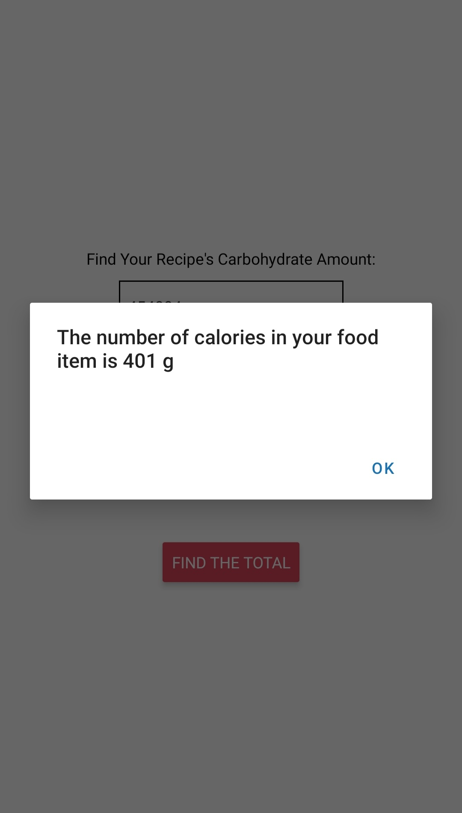

# EC463 Mini-Project
Created by Samarah Uriarte and Jaskaran Gahunia.

## Summary
We present to you NutriList, a mobile application that was created for the CE software mini-project for BU's ENG senior design course. Featuring a simple design and highly intuitive UI, as shown in Figure 1, NutriList has a single page that can be used to find the total number of carbohydrates in a meal. The user must enter the FDC ID of the food they are attempting to get nutritional information on, as well as the number of servings, with an example shown in Figure 2. The FDC ID can be found through the website and the serving size can be found on the item packaging by the user. Then, the user can press "FIND THE TOTAL" and a popup will be shown that provides the total carb amount. Figure 3 illustrates this popup as a continuation from Figure 2.

	

	<strong>Figure 1.</strong> Main page of NutriList app.

 

	

	<strong>Figure 1.</strong> An example of an FDC ID, corresponding to an apple, having been entered, as well as a serving of 1.

 

	

	<strong>Figure 3.</strong> The result of the previous example after the "FIND THE TOTAL" button is pressed.

## Design
NutriList was developed using React Native and tested with Expo Go. React Native was chosen because it is optimal for quickly building mobile applications and provides a framework with many components that can easily be integrated into projects for a more interactive UI. Additionally, testing was simple due to the features Expo Go offers through its mobile application. Using the Expo environment, the project can easily be pulled up on a personal mobile device through a QR code that is provided after running "expo start" in the project directory.

In order to query for nutritional information, the FoodData Central API, which "provides REST access to FoodData Central (FDC)" ([1]) was used. The code for this is shown in Figure 4.

	

	<strong>Figure 4.</strong> The FDC ID is inserted into the URL, which is then fetched via an API call.

## To Run React Server with Expo Go
1. Navigate to the EC463MiniProject/NutriList/ directory.
2. By starting Expo, a QR code will be provided that can be scanned using the Expo Go app to pull up the NutriList application on a mobile device.
   Run the following:
   
       $ expo start
3. Enter the FDC ID of the food you want to find the information for.
4. Enter the number of servings.
5. Press "FIND THE TOTAL" and observe the popup. This will tell you the total number of carbs in the meal.

## References
[1] Fooddata Central API Guide. FoodData Central. (n.d.). Retrieved December 14, 2021, from https://fdc.nal.usda.gov/api-guide.html. 
